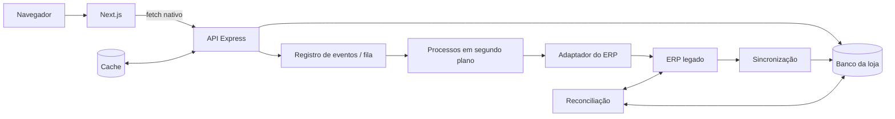

# Respostas conceituais — Parte 1.A

Este documento responde às seis perguntas conceituais do desafio. Ele separa o
que está implementado no mini-projeto da arquitetura recomendada para produção:
SQLite, ERP simulado e processamento local em segundo plano mantêm a execução
simples, mas não são apresentados como solução definitiva.

## 1. Diagnóstico e trade-offs

Os três sintomas têm a mesma origem: vitrine, estoque e checkout dependem do
ERP monolítico em caminhos síncronos, apesar de possuírem requisitos distintos.
Catálogo tolera alguma defasagem; estoque exige consistência concorrente; pedido
e faturamento podem continuar de forma assíncrona.

### Vitrine lenta

**Causa e impacto.** Milhões de acessos passam pela API síncrona do ERP e acabam
pressionando tanto o monólito quanto seu banco MySQL. A lentidão prejudica a
experiência do cliente, reduz conversões e também afeta as rotinas internas.

1. **Catálogo próprio da loja:** copiar produtos e preços periodicamente para um
   banco voltado à leitura. Reduz a dependência do ERP, mas aceita pequena
   defasagem e exige sincronização.
2. **Cache das respostas do ERP:** reduz a latência com menor mudança inicial,
   mas a loja continua dependente do ERP quando o cache expira e precisa tratar
   dados desatualizados.

**Prioridade:** começaria pelo catálogo próprio, porque reduz de forma permanente
a quantidade de acessos ao ERP. O cache pode ser adicionado depois para os
produtos mais consultados.

### Venda sem estoque

**Causa e impacto.** Duas requisições podem ler a mesma quantidade antes de
qualquer atualização. Isso gera cancelamentos, atendimento adicional, perda
financeira e quebra de confiança do cliente.

1. **Reserva atômica no banco da loja:** a própria atualização verifica e reduz
   o estoque dentro da transação do pedido. Evita estoque negativo, mas exige
   uma posição própria e reconciliação com o ERP.
2. **Fila sequencial por produto:** processa uma compra de cada vez para o mesmo
   item. Evita a disputa, mas aumenta a latência e exige infraestrutura e
   recuperação da fila.

**Prioridade:** usaria a reserva atômica, pois oferece resposta imediata e
funciona em múltiplas instâncias sem depender de trava em memória.

### Timeout no checkout

**Causa e impacto.** A chamada ao ERP e o faturamento permanecem dentro da
requisição do cliente. Quando ocorre timeout, o resultado fica incerto e uma
nova tentativa pode duplicar o pedido.

1. **Pedido persistido e processamento assíncrono:** cria o pedido antes de
   chamar o ERP, retorna processamento quando necessário e permite consultar o
   status. Exige estados, processo em segundo plano e política de tentativas.
2. **Aumentar o timeout e repetir a chamada:** é mais simples inicialmente, mas
   mantém conexões abertas, piora nos picos e não elimina a dúvida sobre o
   resultado da compra.

**Prioridade:** persistiria o pedido e retiraria o ERP da espera do cliente. A
idempotência permitiria repetir a intenção sem criar outro pedido.

## 2. Arquitetura alvo incremental

O Next.js apresenta catálogo, carrinho e estados da compra. O Express é a
fronteira HTTP e a fonte única das regras. O ERP permanece inalterado atrás de
um adaptador.

| Componente | Responsabilidade | Situação |
| --- | --- | --- |
| Next.js | Apresentar produtos, carrinho e situação da compra | Implementado |
| API Express | Validar requisições e aplicar regras de produtos, pedidos e estoque | Implementado |
| Banco da loja | Guardar catálogo, estoque, pedidos e chaves contra duplicidade | SQLite local; banco servidor no futuro |
| Cache | Manter temporariamente produtos muito consultados | Futuro |
| Processo em segundo plano | Enviar pedidos ao ERP fora da espera do cliente | Local implementado; independente no futuro |
| Registro de eventos e fila | Garantir processamento mesmo após falhas ou picos | Futuro |
| Adaptador do ERP | Isolar formato, lentidão e erros do sistema legado | Simulador implementado |
| Sincronização | Copiar dados do ERP para a base da loja | Futuro |
| Conferência de divergências | Comparar e corrigir diferenças entre loja e ERP | Futuro |
| Acompanhamento operacional | Logs, medidas, rastreamento e alertas | Logs implementados; restante futuro |



No mini-projeto, o banco da loja é SQLite, a fila é substituída por um processo
local e o ERP é simulado. Esses atalhos preservam a separação de
responsabilidades e permitem evoluir sem reescrever a aplicação.

### Fluxos principais

**Produtos e preços**

1. Uma tarefa automatizada usa o acesso de leitura para copiar dados do MySQL.
2. Se houver data ou versão confiável, lê somente as alterações; caso contrário,
   compara cópias periódicas sem modificar tabelas ou rotinas do ERP.
3. Os dados são padronizados e inseridos ou atualizados no banco da loja.
4. Preços permanecem inteiros em centavos.
5. A API consulta apenas a base local; um cache opcional mantém produtos
   populares por um prazo definido e informa há quanto tempo foram atualizados.
6. Falha de sincronização mantém o último catálogo válido e gera alerta, sem
   voltar a consultar o ERP por acesso.

**Estoque**

1. O banco da loja recebe uma posição inicial conhecida.
2. Cada checkout reserva por decremento condicional atômico.
3. Pedido e todos os itens pertencem à mesma transação.
4. Confirmação mantém a quantidade consumida; falha definitiva libera uma vez.
5. Uma tarefa posterior compara posições e movimentos com o ERP.

**Checkout**

1. O navegador envia o carrinho completo e uma `Idempotency-Key`.
2. O Express valida a estrutura e calcula um identificador a partir do carrinho
   organizado de forma padronizada.
3. A transação reserva todos os itens e cria o pedido; qualquer falha faz
   a transação ser desfeita por completo.
4. O processador chama o ERP. Confirmação rápida retorna `201`; processamento
   demorado retorna `202` e `statusUrl`.
5. Falha temporária permite nova tentativa da mesma intenção; falha definitiva
   marca `FAILED` e devolve o estoque.
6. O front-end consulta periodicamente o pedido até o estado final ou seu limite
   de tempo.

Em produção, a mesma operação que grava o pedido também deve registrar que ele
precisa ser processado. Outro processo envia esse registro para uma fila. Assim,
uma falha entre salvar o pedido e chamar o ERP não faz a compra desaparecer.

### Plano de 30, 60 e 90 dias

| Período | Entregas |
| --- | --- |
| 0–30 dias | Medir lentidão e erros; criar uma API intermediária e um catálogo local; persistir as chaves contra duplicidade; acompanhar dados desatualizados, conflitos de estoque e pedidos pendentes; liberar gradualmente |
| 31–60 dias | Migrar para um banco preparado para mais escritas; testar concorrência; adicionar fila confiável e processos independentes; espaçar novas tentativas, pausar chamadas após falhas repetidas e separar mensagens problemáticas |
| 61–90 dias | Automatizar a conferência entre loja e ERP; adicionar validade às reservas; melhorar a velocidade de sincronização quando o acesso permitir; definir metas de disponibilidade, alertas e guias operacionais |

Nenhuma etapa exige alterar ou reescrever o ERP. A loja assume gradualmente sua
própria base de consulta, o controle de reservas e o fluxo dos pedidos.

## 3. Estoque, concorrência e idempotência

Considere duas compras diferentes disputando um produto ativo com estoque `1`:

1. as duas requisições validam estrutura e possuem chaves distintas;
2. cada transação ordena os itens por `productId`;
3. para cada item, executa uma atualização equivalente a:

   ```sql
   UPDATE Product
      SET stock = stock - :quantity
    WHERE id = :productId
      AND active = true
      AND stock >= :quantity;
   ```

4. somente uma atualização da última unidade afeta uma linha;
5. se nenhuma linha for alterada, uma leitura serve apenas para diferenciar
   produto inexistente de estoque insuficiente;
6. o vencedor cria pedido e itens na mesma transação; a transação do perdedor é
   desfeita por completo e retorna `409 INSUFFICIENT_STOCK`.

O valor lido anteriormente nunca decide o decremento. A condição da própria
escrita arbitra a concorrência, e uma restrição adicional do banco impede
`stock` menor que zero.
O teste HTTP comprova uma aceitação, uma rejeição e estoque final zero.

### Ciclo da reserva

| Estado | Comportamento do estoque |
| --- | --- |
| `PENDING` ou `PROCESSING` | Permanece reservado |
| `CONFIRMED` | Permanece consumido |
| `FAILED` após o limite | É devolvido em transação única |
| `STOCK_REJECTED` | Nenhuma reserva foi criada |

O estoque só é devolvido quando ainda não existe registro de liberação, o pedido
está no estado esperado e o processo possui um token válido. O modelo local não
expira reservas, portanto uma falha prolongada pode prender estoque. Em
produção, cada reserva deve registrar validade e estado; uma tarefa automatizada
expira reservas abandonadas sem competir com pedidos ativos ou confirmações
atrasadas.

### Novas tentativas e idempotência

- o front-end desabilita o botão durante envio, mas a garantia real fica no
  banco;
- timeout não significa que o pedido falhou, portanto a nova tentativa conserva
  chave e payload;
- um identificador SHA-256 é calculado com os itens padronizados e ordenados por
  `productId`;
- a chave de idempotência possui restrição única no banco;
- mesma chave e mesmo conteúdo retornam o pedido existente sem nova reserva ou
  chamada ao ERP;
- mesma chave e conteúdo diferente retornam `409 IDEMPOTENCY_CONFLICT`;
- em uma corrida simultânea, a restrição única permite somente um pedido; a
  transação perdedora é desfeita e recupera o pedido já criado;
- alterar item ou quantidade gera uma nova intenção e uma nova chave.

Em produção, a chave precisa permanecer armazenada por mais tempo que o maior
período possível de novas tentativas de clientes ou sistemas intermediários. A
integração real com o ERP também deve reconhecer o mesmo `orderId` sem duplicar
efeitos.

### Reconciliação e banco de produção

Mesmo com transações locais corretas, vendas externas, ajustes no ERP e
confirmações tardias podem gerar divergência. A reconciliação deve trabalhar
com marcadores de progresso, comparar estoque físico, disponível, reservado e
confirmado, não sobrescrever reservas ativas, registrar correções e encaminhar
casos ambíguos para análise humana.

SQLite é adequado à demonstração, mas limita escritas simultâneas e um arquivo
local não atende várias máquinas. PostgreSQL preserva a atualização condicional
e oferece melhor controle de concorrência, conexões e transações. Cada
processamento recebe um direito temporário e um token; somente quem ainda possui
esse direito pode alterar o pedido. Isso impede que um processo atrasado
sobrescreva um resultado mais recente, embora não cancele uma chamada já enviada
ao ERP.

## 4. Contrato de API e modelo de erros

Pedido mínimo:

```http
POST /api/orders
Content-Type: application/json
Idempotency-Key: checkout-7c8fb31a-01

{
  "items": [
    { "productId": "case-clear-iphone-15", "quantity": 2 },
    { "productId": "case-armor-galaxy-s24", "quantity": 1 }
  ]
}
```

`X-Request-Id` é opcional na entrada e sempre devolvido pela API. A chave de
idempotência é obrigatória.

Confirmação síncrona:

```json
{
  "order": {
    "id": "order-id",
    "status": "CONFIRMED",
    "totalPriceInCents": 10970,
    "items": [
      {
        "productId": "case-clear-iphone-15",
        "name": "Capinha Transparente Air para iPhone 15",
        "unitPriceInCents": 2990,
        "quantity": 2,
        "subtotalInCents": 5980
      },
      {
        "productId": "case-armor-galaxy-s24",
        "name": "Capinha Armor Preta para Galaxy S24",
        "unitPriceInCents": 4990,
        "quantity": 1,
        "subtotalInCents": 4990
      }
    ],
    "createdAt": "2026-08-03T12:00:00.000Z",
    "updatedAt": "2026-08-03T12:00:00.120Z"
  }
}
```

Processamento assíncrono:

```json
{
  "orderId": "order-id",
  "status": "PROCESSING",
  "statusUrl": "/api/orders/order-id"
}
```

Replay devolve `200`, o estado persistido atual e o header:

```http
Idempotency-Replayed: true
```

Todos os erros usam o mesmo envelope:

```json
{
  "error": {
    "code": "VALIDATION_ERROR",
    "message": "Os dados enviados são inválidos.",
    "details": {
      "fields": [
        {
          "field": "items[0].quantity",
          "message": "A quantidade deve ser um inteiro maior que zero."
        }
      ]
    },
    "retryable": false,
    "requestId": "request-id"
  }
}
```

| Cenário | HTTP e código | Reação do front-end |
| --- | --- | --- |
| Confirmado | `201` | Exibe sucesso, limpa carrinho e atualiza produtos |
| Processando | `202` | Exibe processamento e inicia consultas periódicas |
| Replay | `200` + `Idempotency-Replayed` | Reflete o estado sem criar nova intenção |
| Entrada inválida | `400 VALIDATION_ERROR` ou `IDEMPOTENCY_KEY_REQUIRED` | Orienta correção; não repete automaticamente |
| Produto ou pedido inexistente | `404 PRODUCT_NOT_FOUND` ou `ORDER_NOT_FOUND` | Atualiza catálogo ou informa indisponibilidade |
| Estoque insuficiente | `409 INSUFFICIENT_STOCK` | Preserva carrinho, destaca itens e atualiza estoque |
| Chave com outro payload | `409 IDEMPOTENCY_CONFLICT` | Exige nova intenção explícita |
| ERP temporário | `503 ERP_TEMPORARILY_UNAVAILABLE`, `retryable: true` | Preserva carrinho e chave; acompanha ou tenta novamente |
| Limite do ERP | `502 ERP_PROCESSING_FAILED` | Informa falha final; estoque já foi liberado |
| Erro inesperado | `500 INTERNAL_ERROR` | Exibe mensagem genérica e conserva a chave em uma nova tentativa cautelosa |

`GET /api/orders/:id` permite acompanhar `PENDING` e `PROCESSING`. As consultas
periódicas terminam em `CONFIRMED`, `FAILED`, `STOCK_REJECTED` ou no limite do
cliente. Mensagens são decididas por `code` e `retryable`, sem interpretar o
texto. Rastreamento do erro, causa interna e objetos Prisma não são enviados ao
cliente.

## 5. Testes e estratégia de validação

| Camada | Cobertura atual |
| --- | --- |
| Unitários | Regras de negócio, identificador do pedido, simulador do ERP, persistência, validação e processamento em segundo plano |
| Integração HTTP | Express em `127.0.0.1`, porta efêmera e `fetch` nativo, sem Supertest |
| Persistência | SQLite temporário por suíte, estrutura real do banco, limpeza e encerramento das conexões |
| Concorrência | Última unidade, mesma chave simultânea, cancelamento integral e estoque final |
| Contrato | Tipos públicos compartilhados, respostas explícitas, testes HTTP e verificação do formato no cliente |
| Front-end | Jest, jsdom, Testing Library e `user-event`, observando comportamento visível |

A cobertura inclui catálogo, validação, pedidos, valores monetários,
idempotência, códigos HTTP e consultas de status. Também verifica que somente um
processo altera cada pedido, que o estoque é devolvido uma única vez e que a
tela apresenta carregamento, bloqueia cliques repetidos, permite novas
tentativas e atualiza o estoque.

A suíte enxuta possui 83 testes: 2 de contratos, 64 da API e 17 do web. Os casos
redundantes foram removidos sem retirar os cenários críticos do desafio.
`npm run check` executa typecheck, testes e build; `npm run lint` é separado.

Testes adequados para a próxima etapa, mas fora da cobertura atual:

- fluxo completo em navegador real;
- carga, duração prolongada e caos;
- compatibilidade automática entre versões do front-end e da API;
- matriz de CI;
- mesma suíte concorrente em PostgreSQL e múltiplas instâncias.

TypeScript não valida respostas recebidas pela rede. Por isso, a API usa
`express-validator`, os endpoints são testados por HTTP real e o cliente confere
manualmente o formato das respostas. A validação humana complementa a automação
com navegação por teclado, rede lenta e conferência de logs por `requestId` e
`orderId`.

## 6. Uso de IA no desenvolvimento

A IA foi ferramenta de apoio, não fonte automática de verdade. Os principais
registros estão em [PROMPTS.md](../PROMPTS.md).

**Tipos de prompt utilizados**

- planejamento com contexto, restrições e critérios de aceite;
- revisão de arquitetura buscando riscos e alternativas;
- revisão de código com foco em concorrência, idempotência e erros;
- criação de testes a partir de comportamentos observáveis;
- conferência da documentação contra código e comandos reais.

**Usos principais**

- decomposição do problema e comparação de alternativas;
- rascunhos de estrutura, contratos e testes;
- levantamento de cenários de risco de concorrência, idempotência e consultas
  periódicas;
- revisão de consistência entre código, testes e documentação.

**Decisões não delegadas**

- autoridade de estoque e regras de compensação;
- aprovação da arquitetura e dos trade-offs;
- validação da transação e dos testes concorrentes;
- segurança, privacidade, liberação gradual e afirmação final de prontidão.

**Como as sugestões foram verificadas**

- leitura do enunciado e inspeção das alterações do banco e dos contratos;
- typecheck, lint, testes e build reais;
- conferência das regras críticas: carrinho tudo ou nada, estoque não negativo,
  uma chave cria no máximo um pedido, repetição não duplica efeitos, consulta de
  status termina e estoque é devolvido apenas uma vez;
- separação explícita entre funcionalidades implementadas e propostas futuras.

| Risco da IA | Controle aplicado |
| --- | --- |
| Código plausível, porém incorreto | Typecheck, documentação oficial quando necessária e build |
| Falha de concorrência não percebida | Condições aplicadas pelo banco e testes simultâneos |
| Teste que valida apenas simulações | HTTP real e SQLite isolado |
| Documentação divergente | Inventário de arquivos e execução dos comandos antes de afirmar cobertura |
| Violação de restrições | Revisão das dependências e da fronteira Express/Next.js |
| Exposição de dados | Erros públicos padronizados e logs com campos permitidos |
| Dependência excessiva da IA | Decisões registradas com motivos e revisão humana obrigatória |

## Conclusão

A evolução reduz a dependência direta do ERP sem reescrevê-lo. O catálogo local
acelera a vitrine, a reserva no banco impede venda sem estoque e o pedido pode
continuar sendo processado mesmo quando o ERP demora. O mini-projeto comprova
essas regras com Express, Prisma, SQLite, Next.js e Jest. Para produção, ainda
seriam necessários um banco mais escalável, sincronização real, fila confiável,
processos independentes e monitoramento completo.
