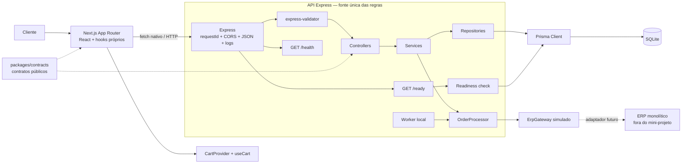
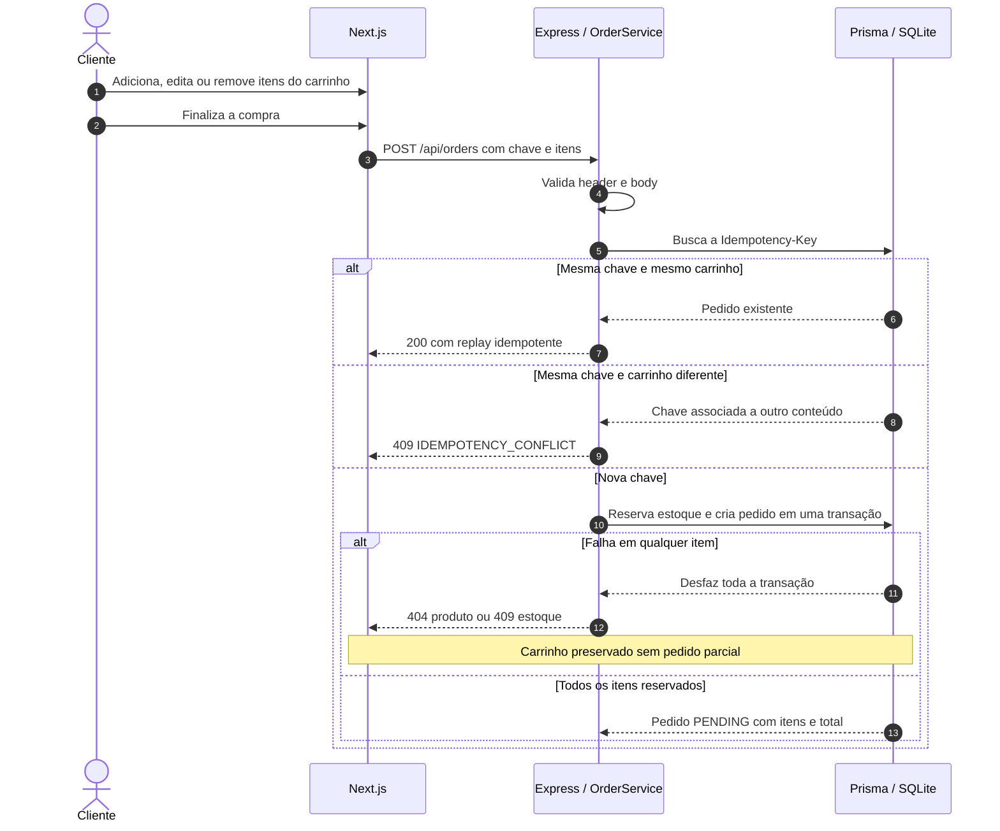
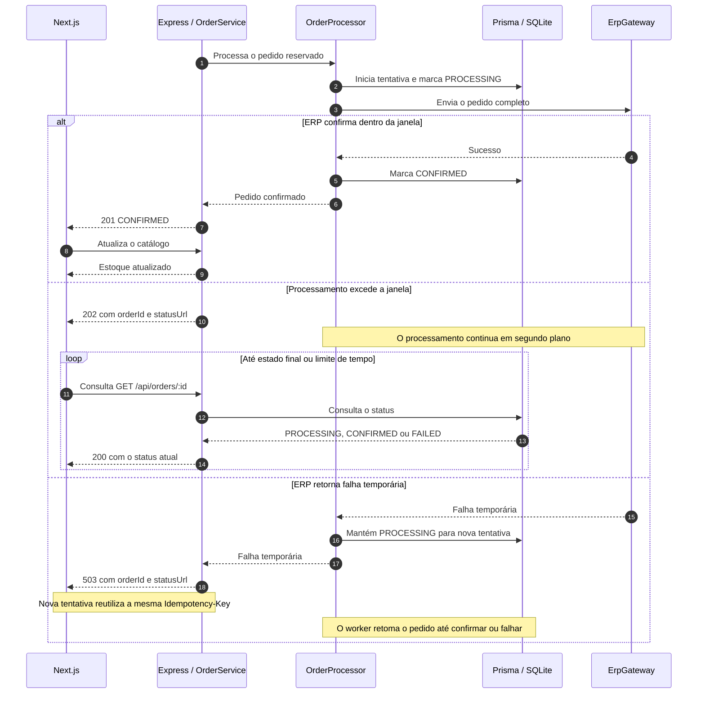

# Arquitetura e sequência do checkout

## Arquitetura do mini-projeto

O Next.js é exclusivamente a camada de apresentação. Todas as validações HTTP,
regras de aplicação, idempotência, reserva de estoque e decisões sobre o ERP
permanecem na API Express.

O worker em processo e o ERP simulado mantêm o mini-projeto autocontido. Em uma
evolução de produção, o contrato do gateway permite substituir a simulação por
um adaptador real, e o worker deve migrar para uma infraestrutura durável com
claim persistente. Essas substituições não exigem mover regras para o Next.js.

## Sequência do checkout

### Criação, idempotência e reserva

### Processamento e acompanhamento

Cada resposta inclui o header `X-Request-Id`, que permite localizar a requisição nos logs. Ao final do processamento, a API registra apenas informações úteis e previamente selecionadas, como `orderId`, `productId` na consulta de um produto, `itemCount`, `status`, `durationMs`, `errorCode` e se a resposta reutilizou um pedido existente. O conteúdo completo da requisição e dados sensíveis não são armazenados.
