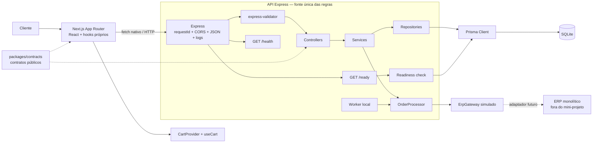

# Arquitetura e sequência do checkout

## Arquitetura do mini-projeto

O Next.js é exclusivamente a camada de apresentação. Todas as validações HTTP,
regras de aplicação, idempotência, reserva de estoque e decisões sobre o ERP
permanecem na API Express.



O worker em processo e o ERP simulado mantêm o mini-projeto autocontido. Em uma
evolução de produção, o contrato do gateway permite substituir a simulação por
um adaptador real, e o worker deve migrar para uma infraestrutura durável com
claim persistente. Essas substituições não exigem mover regras para o Next.js.

## Sequência do checkout

```mermaid
sequenceDiagram
    autonumber
    actor Cliente
    participant Web as Next.js
    participant API as Express
    participant Service as OrderService
    participant DB as Prisma / SQLite
    participant Processor as OrderProcessor
    participant ERP as ErpGateway

    Cliente->>Web: Adiciona, edita ou remove itens do carrinho
    Cliente->>Web: Seleciona Finalizar compra
    Web->>API: POST /api/orders + Idempotency-Key + items[]
    API->>API: Valida header, array, itens únicos e campos extras
    API->>Service: create(items, key, requestId)
    Service->>DB: Procura Idempotency-Key

    alt Chave existente e payload igual
        DB-->>Service: Pedido existente
        Service-->>API: Replay sem nova reserva e sem novo ERP
        API-->>Web: 200 + Idempotency-Replayed: true
    else Chave existente e payload diferente
        DB-->>Service: Pedido com outro requestHash
        Service-->>API: IDEMPOTENCY_CONFLICT
        API-->>Web: 409
    else Nova intenção
        Service->>DB: Transação: ordena itens + updateMany de cada produto + Order/OrderItems

        alt Qualquer produto ausente ou sem estoque
            DB-->>Service: Rollback de todas as reservas
            Service-->>API: PRODUCT_NOT_FOUND ou INSUFFICIENT_STOCK
            API-->>Web: 404 ou 409
            Note over Web,DB: Carrinho preservado; nenhum pedido ou item parcial
        else Carrinho inteiro reservado
            DB-->>Service: Pedido PENDING com snapshots, subtotais e total
            Service->>Processor: processOrder(orderId, requestId)
            Processor->>DB: Incrementa processingAttempts e marca PROCESSING
            Processor->>ERP: processOrder(pedido completo, contexto)

            alt ERP confirma dentro da janela síncrona
                ERP-->>Processor: SUCCESS + durationMs
                Processor->>DB: Marca CONFIRMED
                Processor-->>Service: Pedido confirmado
                Service-->>API: CREATED
                API-->>Web: 201
                Web->>Web: Exibe resumo e limpa o carrinho
                Web->>API: GET /api/products
                API-->>Web: Estoque atualizado
            else ERP continua após a janela síncrona
                Service-->>API: ACCEPTED
                API-->>Web: 202 + orderId + statusUrl
                loop Até estado final ou limite do polling
                    Web->>API: GET /api/orders/:id
                    API->>DB: Consulta status
                    DB-->>API: PROCESSING, CONFIRMED ou FAILED
                    API-->>Web: 200 + status
                end
            else ERP retorna falha temporária
                ERP-->>Processor: TEMPORARY_FAILURE + errorCode + durationMs
                Processor->>DB: Mantém PROCESSING para retry
                Service-->>API: ERP_TEMPORARILY_UNAVAILABLE
                API-->>Web: 503 + orderId + statusUrl
                Note over Web,API: Retry reutiliza a mesma Idempotency-Key
            end
        end
    end
```

Cada resposta inclui `X-Request-Id`. O log HTTP concluído agrega o contexto
allowlisted conhecido naquele ponto, como `orderId`, `productId` em rotas
unitárias, `itemCount`, `status`, `durationMs`, `errorCode` e indicação de replay
idempotente.
