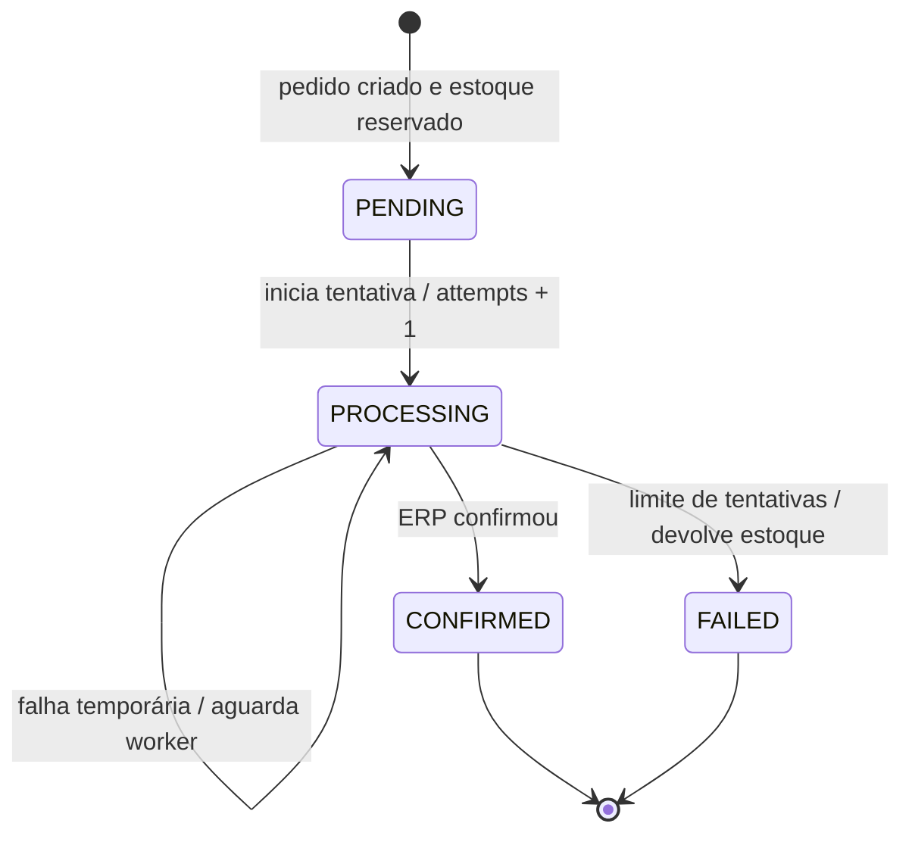

# Processamento simulado do ERP

## Configuração

| Variável | Padrão | Regra |
| --- | ---: | --- |
| `ERP_SIMULATION_MODE` | `automatic` | `automatic`, `success`, `slow` ou `temporary-failure` |
| `ERP_MIN_DELAY_MS` | `50` | Inteiro maior ou igual a zero |
| `ERP_MAX_DELAY_MS` | `150` | Inteiro maior ou igual ao mínimo |
| `ERP_FAILURE_RATE` | `0` | Número entre `0` e `1` |
| `ERP_SYNC_TIMEOUT_MS` | `200` | Inteiro maior que zero |
| `ERP_MAX_ATTEMPTS` | `3` | Inteiro maior que zero |
| `ERP_PROCESSING_LEASE_MS` | `30000` | Inteiro maior que zero |

O gateway usa apenas dependências injetáveis para aleatoriedade, espera e
relógio. A implementação padrão utiliza `Math.random`, `setTimeout` e
`Date.now` dentro do próprio gateway; o service não conhece aleatoriedade.

## Modos de simulação

- `success`: aplica um atraso entre mínimo e máximo e confirma.
- `slow`: aplica pelo menos `ERP_SYNC_TIMEOUT_MS + 1` e confirma depois.
- `temporary-failure`: aplica o atraso e retorna uma falha temporária.
- `automatic`: o atraso é sorteado e `ERP_FAILURE_RATE` decide a falha.

Os modos explícitos são usados nos testes determinísticos e podem ser
selecionados manualmente no `.env` para os cenários da documentação OpenAPI.
A execução normal usa `automatic`.

O Swagger UI está disponível em `http://localhost:3333/docs`. A especificação
inclui exemplos para sucesso síncrono, timeout com resposta `202` e polling,
falha temporária, esgotamento de tentativas e devolução de estoque. Alterar o
modo exige reiniciar a API; no ambiente local isso também executa o seed
destrutivo descrito no README.

## Fluxo e estados

Se qualquer reserva falhar, a transação retorna `409 INSUFFICIENT_STOCK` e não
persiste pedido parcial. `STOCK_REJECTED` permanece no contrato de estados por
compatibilidade e pode ser interpretado pelo polling, mas o fluxo atual de
criação rejeita antes de existir um `Order`.

### Reserva

O estoque de todos os itens é reservado antes de qualquer chamada ao ERP, na
mesma transação que cria o pedido `PENDING` e seus `OrderItem`. Cada reserva usa
`updateMany` condicional e decremento atômico; se uma falhar, todas são
revertidas. O pedido nunca é criado como processável sem o carrinho inteiro.

### Confirmação

Cada tentativa muda o pedido inteiro para `PROCESSING` e incrementa
`processingAttempts` antes de chamar o gateway. O pedido só vira
`CONFIRMED` após o resultado `SUCCESS` do ERP para todos os itens.

### Timeout síncrono

O Express aguarda até `ERP_SYNC_TIMEOUT_MS`. Se a tentativa ainda estiver em
andamento, responde HTTP 202 com `orderId`, `status` e `statusUrl`. A
tentativa não é cancelada: ela continua em background e mantém a exclusão do
pedido até terminar ou até o lease expirar.

### Falha temporária

Antes do limite, o pedido permanece `PROCESSING` com código e mensagem de
erro internos. O worker local consulta pedidos `PENDING` ou `PROCESSING` e
inicia a tentativa seguinte. Uma falha temporária concluída dentro da janela
síncrona retorna HTTP 503 e mantém a URL de polling.

### Falha definitiva e devolução

Quando `processingAttempts` alcança `ERP_MAX_ATTEMPTS`, o pedido passa para
`FAILED`. Na mesma transação, cada produto é incrementado pela quantidade do
respectivo `OrderItem` e
`stockReleasedAt` é preenchido. A transição usa `updateMany` condicionado a
`status = PROCESSING` e `stockReleasedAt = null`, e também exige o token do
claim vigente; somente uma execução devolve o carrinho inteiro. Repetições
posteriores não incrementam item algum novamente.

## Exclusão e worker local

O `OrderProcessor` mantém uma execução ativa por `orderId` como otimização
local. A garantia de exclusão fica na tabela interna
`OrderProcessingClaim`: antes de incrementar a tentativa, o processador cria ou
substitui atomicamente um claim expirado com lease e token únicos. Todas as
transições posteriores consomem o token vigente na mesma transação da mudança
de estado. Se outro processador substituir o claim expirado, a resposta tardia
do anterior não pode confirmar, registrar falha nem devolver estoque.

O worker roda dentro do processo Node.js, sem RabbitMQ, Kafka, Redis ou
serviço externo. Isso é uma simplificação adequada ao mini-projeto:

- o processo precisa estar ativo para executar retries;
- um encerramento inesperado depende da próxima inicialização para retomar;
- processos que compartilham o mesmo banco respeitam o claim persistente;
- SQLite local não é um banco compartilhado adequado a instâncias em máquinas
  diferentes;
- o lease é fixo e não é renovado durante a chamada ao ERP;
- após expiração, uma segunda tentativa pode chamar o ERP enquanto a anterior
  ainda está em andamento. O fencing protege o estado local, mas uma integração
  real deve ser idempotente por `orderId` e ter reconciliação;
- múltiplas instâncias de produção ainda exigem PostgreSQL e fila durável.

No graceful shutdown, o servidor para de aceitar HTTP, interrompe o loop do
worker, aguarda processamentos ativos e só então desconecta o Prisma.
